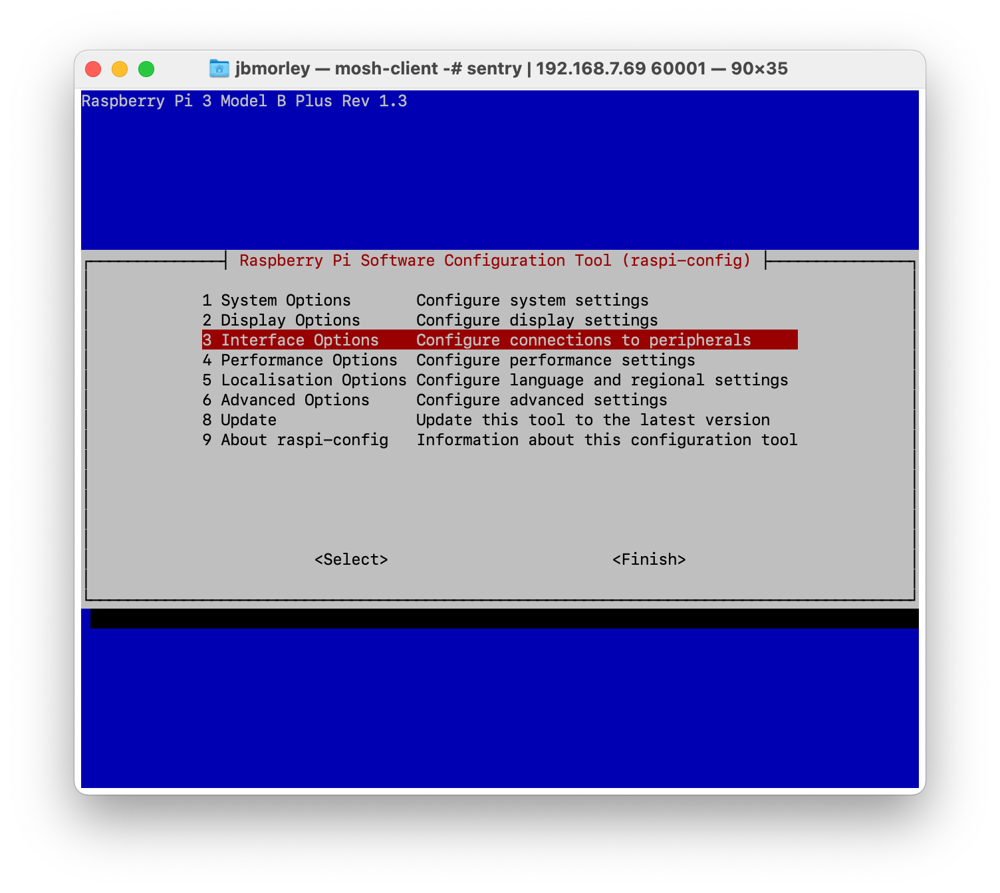
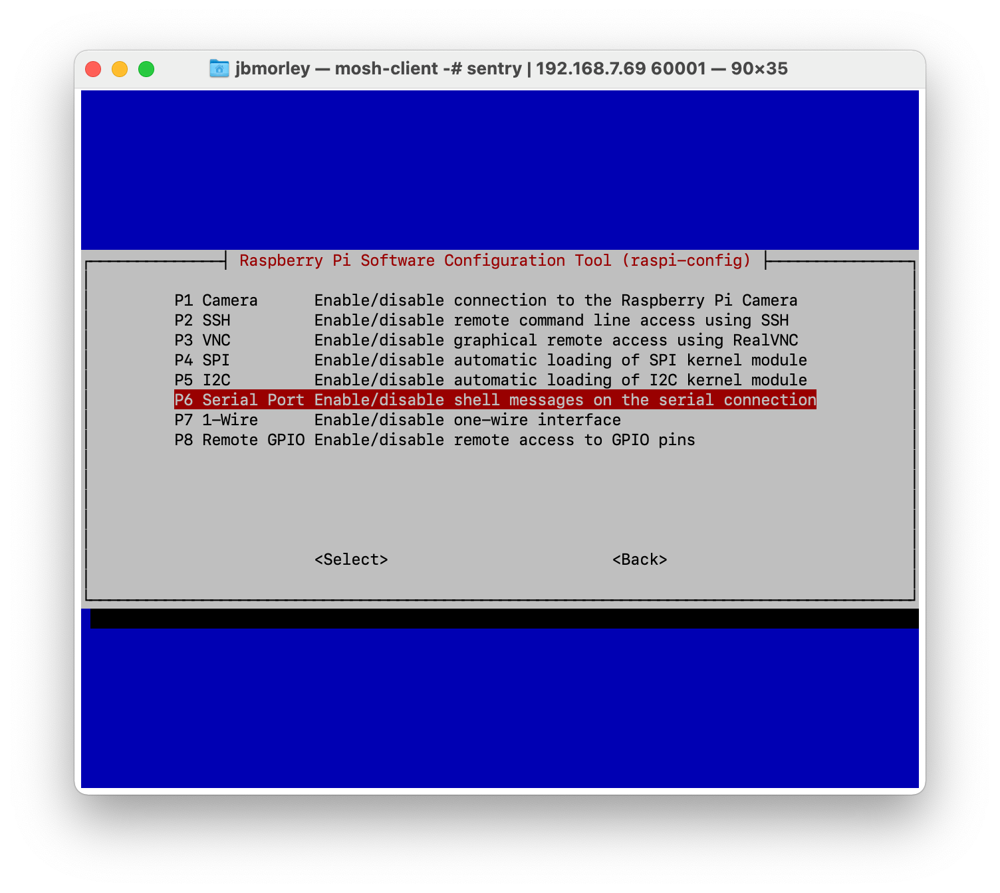
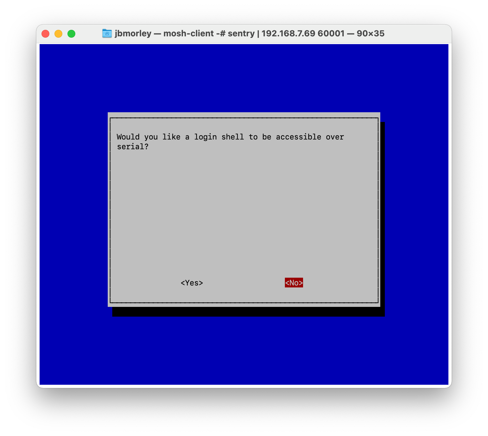
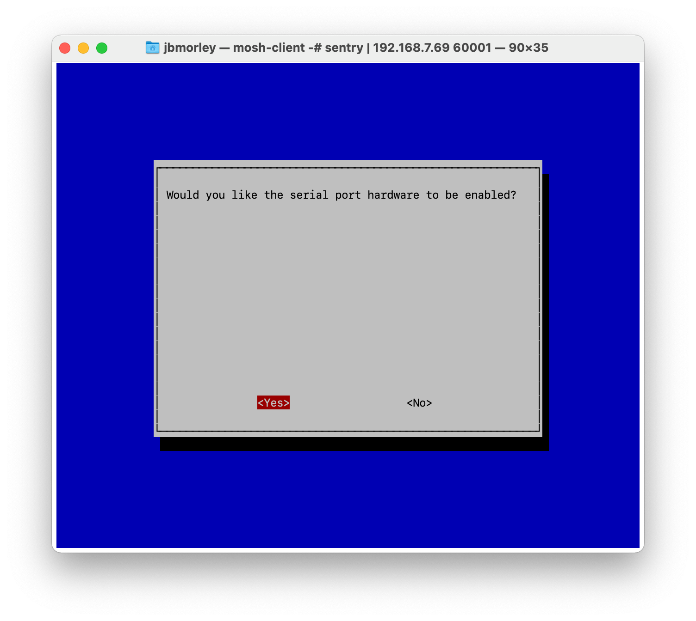
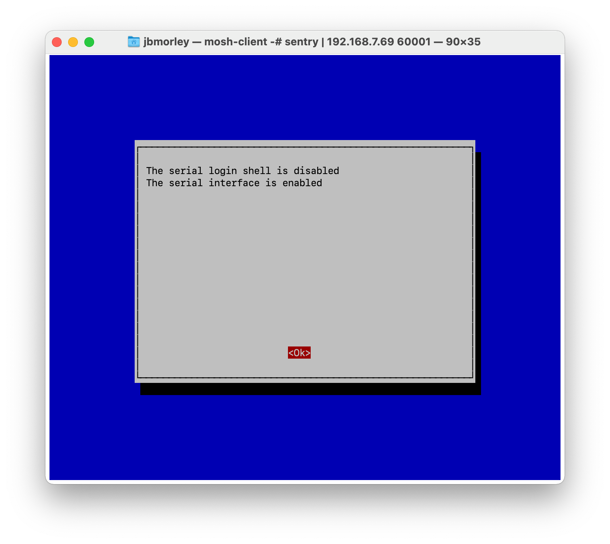

# Python-Thermal-Printer Module

Python3 port of the original Adafruit [Python-Thermal-Printer](https://github.com/adafruit/Python-Thermal-Printer) library.

## Getting Started

Install Raspbian Buster and Wire the printer according to [this](https://learn.adafruit.com/networked-thermal-printer-using-cups-and-raspberry-pi/connect-and-configure-printer). I powered the printer with the GPIO pins as well.

Run a test to see if the printer is working by punching in these commands into the terminal.

```
stty -F /dev/serial0 19200
echo -e "This is a test.\\n\\n\\n" > /dev/serial0
```

### Installing

1. Enable the serial port.

   ```bash
   sudo raspi-config
   ```

   

   

   

   

   

2. Update the system and install perquisites.

   ```
   sudo apt-get update
   sudo apt-get install git cups wiringpi build-essential libcups2-dev libcupsimage2-dev python-serial python-pil python-unidecode
   ```

3. Install the printer driver. Don't worry about the warnings that g++ gives.

   ```
   git clone https://github.com/adafruit/zj-58
   cd zj-58
   make
   sudo ./install
   ```

4. Make the printer the default printer. This is useful if you are going to be doing other things with it.

   ```
   sudo lpadmin -p ZJ-58 -E -v "serial:/dev/serial0?baud=19200" -m zjiang/ZJ-58.ppd
   sudo lpoptions -d ZJ-58
   ```

5. Install the Python dependencies:

   ```bash
   sudo apt-get install --yes python3-pip
   pip3 install --user \
       Pillow \
       pyserial
   ```

6. Restart the system. Clone this repository and try to run *printertest.py*.

   ```
   git clone https://github.com/galacticfan/Python-Thermal-Printer/
   cd Python-Thermal-Printer
   python3 printertest.py
   ```

7. Use `cron` to run the management script on startup by adding the following line to your crontab (`crontab -e`):

   ```
   @reboot /usr/bin/python3 /home/pi/Projects/Python-Thermal-Printer/main.py
   ```

   _You will need to update the path to `main.py` depending on where you cloned the repository._
